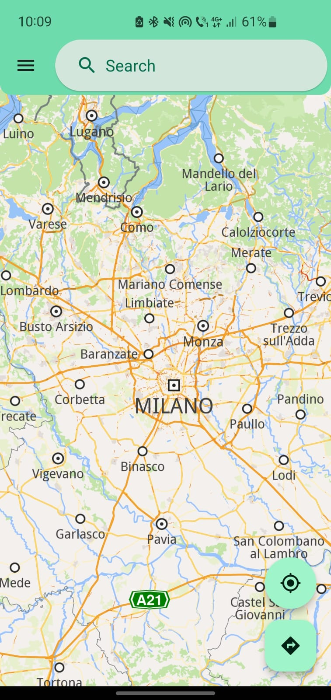
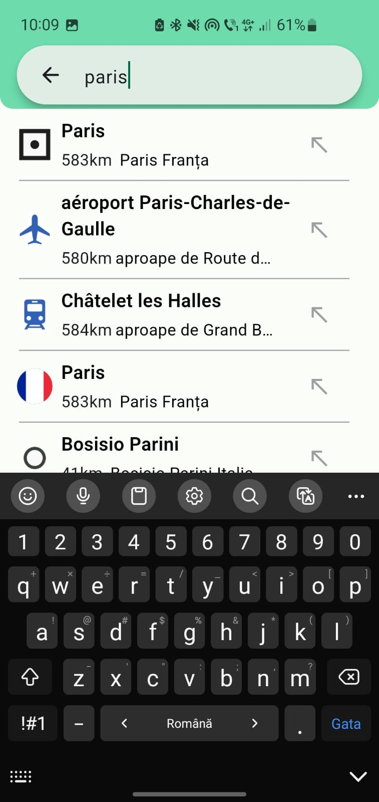
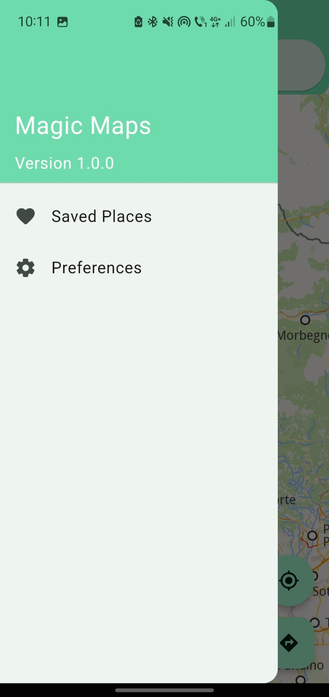
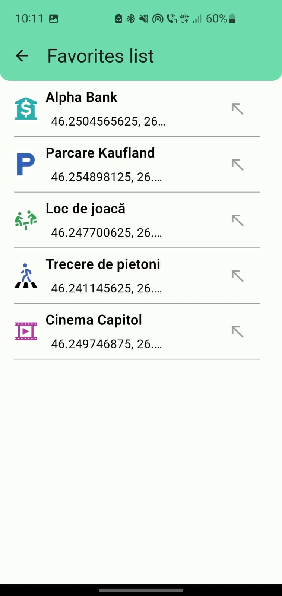

# Magic Maps - Mobile Application using Flutter and Magic Lane's Maps SDK

## Overview

Magic Maps is a mobile application developed in Dart using the Flutter framework. It integrates Magic Lane's Maps and Navigation SDK for enhanced map and navigation functionalities. The project focuses on leveraging location-based services to create a rich and intuitive user experience.

## Features

- **Location Search**: Users can search for locations within the app.
- **Map View**: The app provides a map view for users to explore.
- **Landmark Details**: Users can view detailed information about landmarks.
- **Favorites**: Users can save locations to a favorites page for easy access.

    
    
    
  

## Build Instructions

### Prerequisites
- Download the Magic Lane's Maps and Navigation SDK from [developer.magiclane.com](https://developer.magiclane.com/api/sdk/) and generate an API key.
- Ensure you have Dart and Flutter installed on your development environment.

### Setup
1. Download the SDK and extract it to the predefined folder (plugins/gem_kit).
2. Clone the repository to your local machine.
3. Navigate to the repository root folder containing the `pubspec.yaml` file.
4. Run the terminal command `flutter pub get` to fetch the required dependencies.

### Building the App
- **Android**:
  - Build an Android APK by executing `flutter build apk [--debug|--release]`.
  - Run the app on an attached device using `flutter run --use-application-binary build/app/outputs/flutter-apk/app-[debug|release].apk`.

- **iOS**:
  - Run `pod install` in the `ios` folder.
  - Build the app using `flutter build ios`, then run it on an attached device with `flutter run`.
  - Alternatively, open the `ios/Runner.xcworkspace` project in Xcode for debugging.

- **Web**:
  - Check available runners with `flutter devices`. If Chrome is installed, you'll see a Chrome device.
  - Generate a release build with `flutter build web`. Serve the app from localhost in Chrome using `flutter run -d chrome`.
 
## Implementation Details

- **SDK Integration**: The project integrates Magic Lane's Maps and Navigation SDK for map and navigation functionalities.
- **State Management**: Cubit and get_it are used for state management in the application.
- **Repository Pattern**: Repositories are implemented to abstract the SDK integration and provide a clean interface.

## Development Timeline

The project was developed over a period of 2 weeks during an internship. It served as a learning opportunity for Dart, Flutter, design patterns, and the Magic Lane's Maps and Navigation SDK.

## Limitations

As the project was developed within a short timeframe, it has limited features and may not provide a comprehensive mapping experience.

## Project Details

- **SDK Version**: 1.5.6 (Technical Preview SDK)
- **SDK Download**: [developer.magiclane.com/api/sdk/](https://developer.magiclane.com/api/sdk/)
- **API Key**: [Generate API key here]((https://developer.magiclane.com/api/dashboard))
- **Development Duration**: 2 weeks
- **Development Purpose**: Learning Dart, Flutter, design patterns, and Magic Lane's Maps SDK.

## License

This project is not licensed and comes with no warranty or guarantee of any kind. You are free to view and fork the code for personal and educational purposes, but any use beyond that may require explicit permission from the project contributors.
